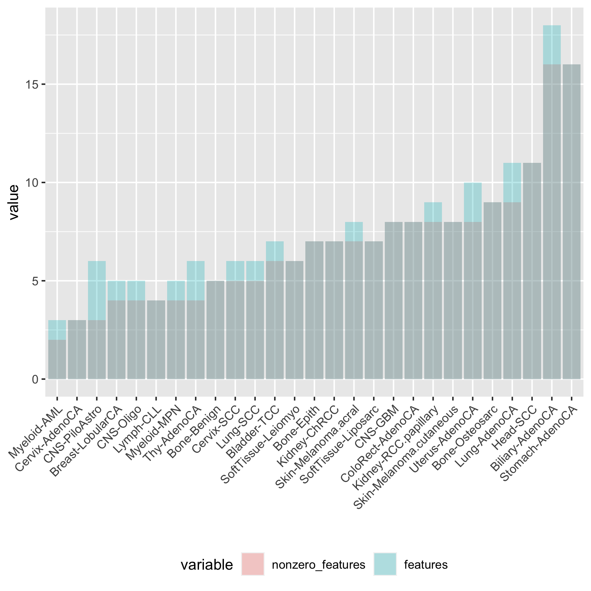
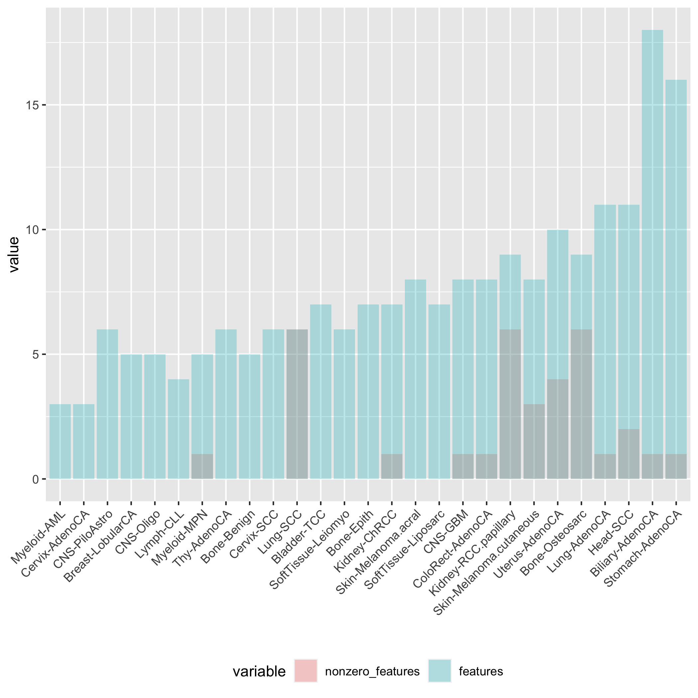

## Ignored folders
The data folder `data/` is restricted and therefore not available

## Environment
To set up the environment, run
```
module load miniconda3-4.5.4-gcc-5.4.0-hivczbz
conda create -n snakemake-globalDA -c conda-forge bioconda::snakemake bioconda::snakemake-minimal -c bioconda

```
to enter the environment, type

```
source activate snakemake-globalDA
...
conda deactivate
```

## Running in clusters

CRUK 
```
source activate snakemake-globalDA
snakemake --cluster "sbatch -p general -t 0:10:00 --cores 1" --jobs 40 --printshellcmds
conda deactivate
```

HPC
```
module load miniconda3-4.5.4-gcc-5.4.0-hivczbz
source activate snakemake-globalDA
snakemake --cluster "sbatch -A MARKOWETZ-SL3-CPU -t 0:10:00 -p skylake --cores 1" --jobs 40 --printshellcmds
```

## Creating Snakemake's config file
The file `config_PCAWG.yaml` is created by running
```
sh make_config.sh
```

`make_config` contains the arguments (i.e. parameters, for the most part) for the different Simulation Generations. Note using `bash make_config.sh` will throw an error - use sh instead.

## copying
scp lm687@login-cpu.hpc.cam.ac.uk:/home/lm687/Global_Differential_Abundance_Pipeline/data/assessing_models_simulation/datasets/multiple_GenerationMixturefewersignaturespairedProstAdenoCAPCAWG* data/assessing_models_simulation/datasets/

scp lm687@login-cpu.hpc.cam.ac.uk:/home/lm687/Global_Differential_Abundance_Pipeline/data/assessing_models_simulation/inference_results/TMB/nlminb/multiple_GenerationMixturefewersignaturespairedProstAdenoCAPCAWG* data/assessing_models_simulation/inference_results/TMB/nlminb/

scp lm687@login-cpu.hpc.cam.ac.uk:/home/lm687/Global_Differential_Abundance_Pipeline/data/assessing_models_simulation/datasets/multiple_GenerationMixturefewersignaturespairedObsNmGaussianVarPCAWGProstAdenoCAPCAWG* data/assessing_models_simulation/datasets/

scp lm687@login-cpu.hpc.cam.ac.uk:/home/lm687/Global_Differential_Abundance_Pipeline/data/assessing_models_simulation/inference_results/TMB/nlminb/multiple_GenerationMixturefewersignaturespairedObsNmGaussianVarPCAWGProstAdenoCAPCAWG* data/assessing_models_simulation/inference_results/TMB/nlminb/


## Synthetic datasets
- Generation A: 20200625. There is a beta intercept of zero


## Code details
### Stan files for inference
The folder `code/2_inference/` contains all the files for inference.

### Simulation under the parameters

To simulate data under the parameters see file `code/3_analysis/posterior_predictive_checks.R`, section `Lower-dimensional representation of posteriors and of observed values [2]`. The corresponding results are in the folder `results/simulation_from_params/`

## Results for the PCAWG cohort

Multinomial             |  Dirichlet-Multinomial
:-------------------------:|:-------------------------:
  | 

Multinomial             |  Dirichlet-Multinomial
:-------------------------:|:-------------------------:
  | 

## Other considerations
### PCAWG samples for which there is no VCF file
These files appear in the metadata and may have them in the mutccf file, but I don't have their VCF, which is the only file that contains what mutation it is (in mutccf you can have the position and CCF, but not mutation type).

```
../data/restricted/pcawg/pcawg_restricted_snv_counts/f8467ec8-2d61-ba21-e040-11ac0c483584
../data/restricted/pcawg/pcawg_restricted_snv_counts/f856fa85-fdb8-c0b0-e040-11ac0d480b4e
../data/restricted/pcawg/pcawg_restricted_snv_counts/f8696c79-b165-92a6-e040-11ac0c4804bf
../data/restricted/pcawg/pcawg_restricted_snv_counts/f393bb00-888d-710f-e040-11ac0d484518
../data/restricted/pcawg/pcawg_restricted_snv_counts/fc8130df-1e8f-c879-e040-11ac0d485df4
../data/restricted/pcawg/pcawg_restricted_snv_counts/fc8130e0-0dcf-b558-e040-11ac0c483285
../data/restricted/pcawg/pcawg_restricted_snv_counts/2ce48f01-2f61-49d9-a56a-7438bf4a37d7
../data/restricted/pcawg/pcawg_restricted_snv_counts/841eb82b-347d-4d7f-805f-3f3701a2983d
../data/restricted/pcawg/pcawg_restricted_snv_counts/4e361622-f9a8-4e9b-a89e-19bafebe1d6a
../data/restricted/pcawg/pcawg_restricted_snv_counts/5ab6a1d3-76f8-45d4-a430-d9831daa9ec4
../data/restricted/pcawg/pcawg_restricted_snv_counts/86ae34f9-e16a-4593-8e55-b1296782bc1f
../data/restricted/pcawg/pcawg_restricted_snv_counts/924bcc4a-c982-43bf-8bbb-641dc983d65e
../data/restricted/pcawg/pcawg_restricted_snv_counts/00493087-9d9d-40ca-86d5-936f1b951c93
../data/restricted/pcawg/pcawg_restricted_snv_counts/2182ce2c-5941-4b65-9419-fc7966d5e6d5
../data/restricted/pcawg/pcawg_restricted_snv_counts/303abbe5-4155-4a0d-bc3b-f8995261ca52
../data/restricted/pcawg/pcawg_restricted_snv_counts/31e63f89-a6a9-40fb-823d-f41587bd73d8
../data/restricted/pcawg/pcawg_restricted_snv_counts/711c8a16-3cf8-42d8-b29e-fd1e9ef1c82b
../data/restricted/pcawg/pcawg_restricted_snv_counts/8853cbee-7931-49a6-b063-a806943a10ad
../data/restricted/pcawg/pcawg_restricted_snv_counts/d3aff5d3-23c0-43ae-9c01-8ddd776b530b
../data/restricted/pcawg/pcawg_restricted_snv_counts/ec43c4b5-fb72-4a4a-af03-10c2d05ff159
../data/restricted/pcawg/pcawg_restricted_snv_counts/f4b9d98f-7b76-4eaa-9595-10b0973d5ff7
../data/restricted/pcawg/pcawg_restricted_snv_counts/526b3796-2cbd-4eec-8273-064b41456279
../data/restricted/pcawg/pcawg_restricted_snv_counts/d25a4c65-9cb4-4611-909e-e68f93408d84
../data/restricted/pcawg/pcawg_restricted_snv_counts/322f0b01-2118-4dbe-aba1-3875a54ee71b
../data/restricted/pcawg/pcawg_restricted_snv_counts/9d29543e-8601-4fd0-8e76-3df3de465cab
../data/restricted/pcawg/pcawg_restricted_snv_counts/005794f1-5a87-45b5-9811-83ddf6924568
../data/restricted/pcawg/pcawg_restricted_snv_counts/0040b1b6-b07a-4b6e-90ef-133523eaf412
../data/restricted/pcawg/pcawg_restricted_snv_counts/84a0bc36-9f29-4b23-aee1-bf5ff71f697b
../data/restricted/pcawg/pcawg_restricted_snv_counts/cb573c96-f6d4-4897-8919-9827f623b6a7
../data/restricted/pcawg/pcawg_restricted_snv_counts/ef78f09c-c622-11e3-bf01-24c6515278c0
../data/restricted/pcawg/pcawg_restricted_snv_counts/f5a97315-1906-4774-980e-0879c6ad368e
../data/restricted/pcawg/pcawg_restricted_snv_counts/692dfa4f-45e5-4183-b5da-6650a1fbcabd
../data/restricted/pcawg/pcawg_restricted_snv_counts/2f324d8b-ec7b-4d3b-9d64-65f9fc6630a2
../data/restricted/pcawg/pcawg_restricted_snv_counts/0ead45d8-d785-4404-8319-2ef951e02e03
../data/restricted/pcawg/pcawg_restricted_snv_counts/37522f18-77b2-4414-8df8-3c2c8048adba
../data/restricted/pcawg/pcawg_restricted_snv_counts/536dedba-46c4-4a21-b112-13c030b13069
../data/restricted/pcawg/pcawg_restricted_snv_counts/541f91bd-7e9d-4348-9e78-45b948d8967e
../data/restricted/pcawg/pcawg_restricted_snv_counts/92dc0e0c-842f-40de-9c39-486b491ea80a
../data/restricted/pcawg/pcawg_restricted_snv_counts/a6ebe0c0-8aab-4b9f-8328-4b795895a77d
../data/restricted/pcawg/pcawg_restricted_snv_counts/bc395326-1656-4ef2-bb19-0cb29194b91c
../data/restricted/pcawg/pcawg_restricted_snv_counts/dd4fdb6a-8067-4b64-ab74-bbb0fec34ca9
../data/restricted/pcawg/pcawg_restricted_snv_counts/ec77847e-48fd-4ba5-bc3e-3cd1b149b552
../data/restricted/pcawg/pcawg_restricted_snv_counts/4d2204f1-be84-4f58-b7e7-61ae9fbf6d25
../data/restricted/pcawg/pcawg_restricted_snv_counts/94b5dc5a-701a-45e3-8f63-8231031a055a
../data/restricted/pcawg/pcawg_restricted_snv_counts/c307688c-b1fa-47f6-a9e2-1ea41f7645b6
../data/restricted/pcawg/pcawg_restricted_snv_counts/005e85a3-3571-462d-8dc9-2babfc7ace21
../data/restricted/pcawg/pcawg_restricted_snv_counts/07531318-87e8-4db8-aa61-9b93597d063b
../data/restricted/pcawg/pcawg_restricted_snv_counts/33de44a2-bec1-402d-872c-d78c1f2d52b3
../data/restricted/pcawg/pcawg_restricted_snv_counts/4d11d7da-1204-437e-87b1-e8337a67c9a8
../data/restricted/pcawg/pcawg_restricted_snv_counts/4e596add-a7c5-4617-9649-b4ac6612e39c
../data/restricted/pcawg/pcawg_restricted_snv_counts/db198301-6c69-4d56-88d1-c650406423dd
../data/restricted/pcawg/pcawg_restricted_snv_counts/f9854144-d92c-46da-ac87-9d1fd7efe67d
../data/restricted/pcawg/pcawg_restricted_snv_counts/f9c52187-2e82-d58a-e040-11ac0d484fc4
../data/restricted/pcawg/pcawg_restricted_snv_counts/f9c52414-385d-8cc7-e040-11ac0d485037
../data/restricted/pcawg/pcawg_restricted_snv_counts/f9c6f4ca-4bb8-26b4-e040-11ac0d485600
../data/restricted/pcawg/pcawg_restricted_snv_counts/f9c70e38-dd99-3fe2-e040-11ac0d4862f2
../data/restricted/pcawg/pcawg_restricted_snv_counts/1d0617e8-2725-4411-b50f-e46ea1d43242
../data/restricted/pcawg/pcawg_restricted_snv_counts/c73f3f82-3091-46dd-b667-e96a1d8c501c
../data/restricted/pcawg/pcawg_restricted_snv_counts/dbd834cb-b14f-4380-9741-f96551268447
../data/restricted/pcawg/pcawg_restricted_snv_counts/dc107863-2c7d-4b19-8afb-666c7798f0da
../data/restricted/pcawg/pcawg_restricted_snv_counts/dd9d2e9e-02dc-40fc-842b-c5b9707fca56
../data/restricted/pcawg/pcawg_restricted_snv_counts/ffb4f42b-58e9-40c3-8963-11804f041375
../data/restricted/pcawg/pcawg_restricted_snv_counts/577d5c9e-fbda-41d5-b0b3-cdb733453ea5
../data/restricted/pcawg/pcawg_restricted_snv_counts/638e80c7-9a6e-4a32-a621-fc4168e72343
../data/restricted/pcawg/pcawg_restricted_snv_counts/950486ad-14f8-480a-b079-9cc3cd842090
../data/restricted/pcawg/pcawg_restricted_snv_counts/9d2671b9-bd30-4e3c-aa74-01e31dd2531e
../data/restricted/pcawg/pcawg_restricted_snv_counts/accfc45b-eae0-4991-a488-e217cdb46655
../data/restricted/pcawg/pcawg_restricted_snv_counts/bcf858fd-cc3b-4fde-ab10-eb96216f4366
../data/restricted/pcawg/pcawg_restricted_snv_counts/c082dc34-457e-40ec-8258-e11e8ed362c2
```
